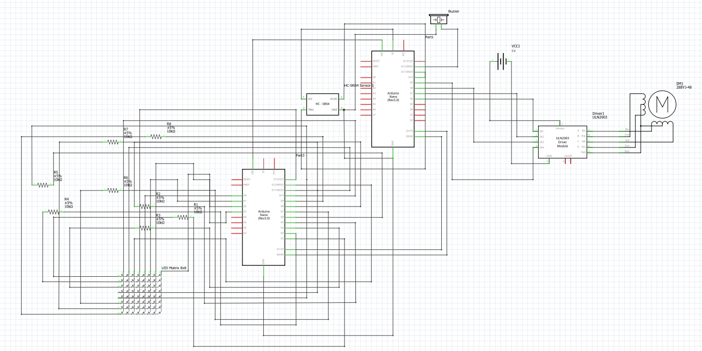
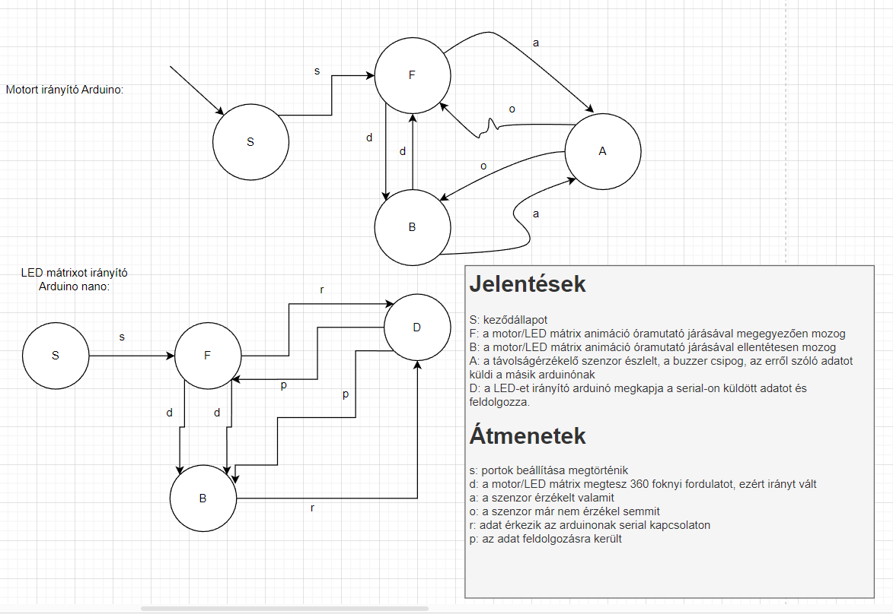

# Funkcionális specifikáció
## 1. Vágyálomrendszer leírása

Projketünk keretében egy Radart készítettünk el.  
A Radar működtetését egy léptető motorral valósítottuk meg, emellett ultrahangos távolságérzékelőt használtunk, ami által adott információk megjelenítésére LED mátrixot alkalmaztunk.

## 2. Alkatrészek

- Arduino nano (2x)
- AA Akkumulátor (1x)
- 28BYJ-48 mini léptető motor  (1x)
- ULN2007APG vezérlő a motorhoz (1x)
- PCDZ Piezo Buzzer (Berregő) (1x)
- 8x8-as LED mátrix (1x)
- HC-SR04 ultrahangos távolságérzékelő (1x)
- Jumper kábelek

## 3. Tervek

### Tervrajz

### Kapcsolási rajz

## 4. Forgatókönyvek

### 4.1 Jelölések:

- Állapotok:
  
  - **S**: Start (Kezdőállapot)
  - **F**: Motor és a mátrixon lévő animáció óramutató járásával megegyező mozgása
  - **B**: Motor és a mátrixon lévő animáció óramutató járásával ellentétes mozgása
  - **A**: Észlelés ultrahangos szenzor által, csipog a buzzer, adatküldés a másik arduino-nak
  - **D**: LED-et működtető arduino megkapja az adatot és feldolgozza.

- Állapotátmenetek:
  
  - s: Portok beállítása sikeresen megtörtént
  - d: A motor elkezd forogni körbe, a mátrixon megindul az animáció
  - a: A szenzor észlel valamit
  - o: A szenzor már nem érzekel semmit
  - r: Adat érkezik az arduinonak serial kapcsolaton
  - p: Az adat feldolgozásra került

### 4.2 Állapotátmenet gráf:

### 4.3 Állapotátmenet táblázat:

|  | S | F | B | A | D |
| - | - | - | - | - | - |
| s | F | - | - | - | - |
| d | F | B | F | - | - |
| a | - | A | A | - | - |
| o | - | - | D | B,F | - |
| r | - | D | D | - | - |
| p | - | - | - | - | F,B |
