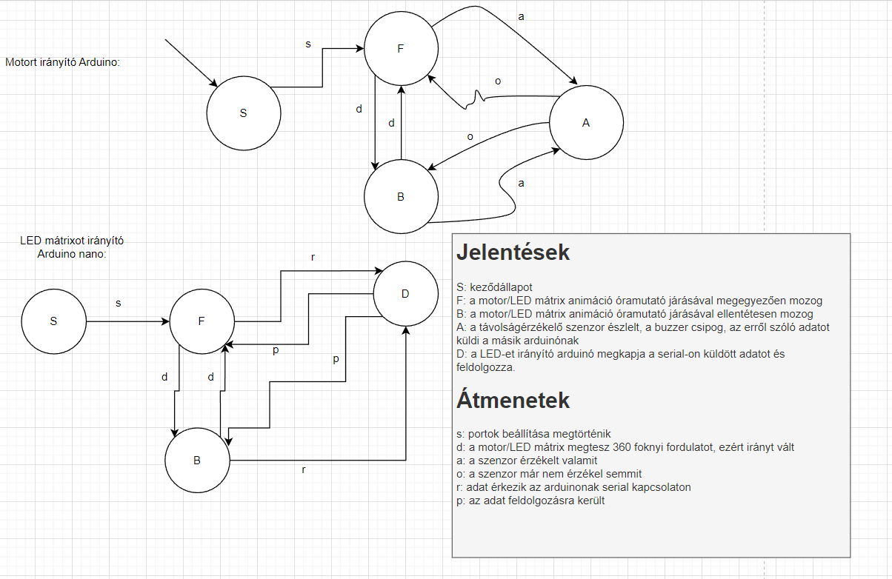

# Funkcionális specifikáció
## 1. Vágyálomrendszer leírása

Projketünk keretében egy Radart készítettünk el.  
A Radar működtetését egy léptető motorral valósítottuk meg, emellett ultrahangos távolságérzékelőt használtunk, ami által adott információk megjelenítésére LED mátrixot alkalmaztunk.

## 2. Alkatrészek

- Arduino uno
- Mini léptető motor 28BYJ-48 (1x)
- Buzzer (Berregő) (1x)
- LED mátrix (1x)
- LED sor (1x)
- RGB LED (1x)
- Ultrahangos távolságérzékelő (1x)
- Gomb (1x)
- Potenciométer (1x)
- Jumper kábelek (Sok)

## 3. Használati esetek

## 4. Képernyőtervek

## 5. Forgatókönyvek

### 5.1 Jelölések:

- Állapotok:
  
  - **S**: Start (Kezdőállapot)
  - **W**: Wait (Várakozás)
  - **R**: (is) Rotating (Forog-e?)
  - **D**: Detect (Észlelés ultrahangos szenzor által)
  - **F**: Failure (Sikertelen tesztelés)

- Állapotátmenetek:
  
  - success: Sikeres kezdeti ellenörzés
  - failure: Sikertelen kezdeti ellenörzés
  - btn_press: Indító/Leállító gombnyomás
  - sensor_detect: Sikeres észelelés a szenzor által
  - no_sensor_detect: Nem észlelt semmit a szenzor

### 5.2 Állapotátmenet gráf:

### 5.3 Állapotátmenet táblázat:

|  | S | W | R | D | F |
| - | - | - | - | - | - |
| success | W | - | - | W | - |
| failure | F | - | - | - | - |
| btn_press | - | R | W | - | - |
| sensor_detect | - | - | D | - | - |
| no_sensor_detect | - | - | - | R | - |
